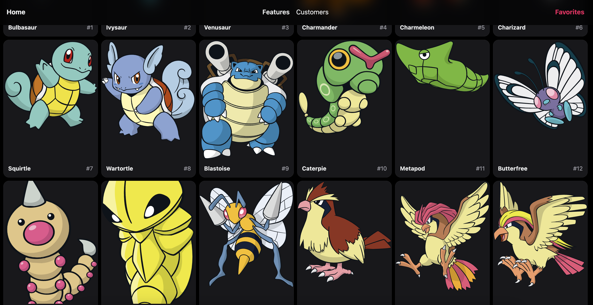
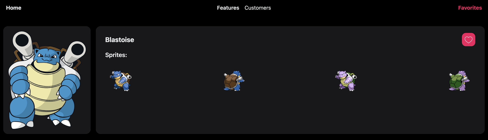

This is a [Next.js](https://nextjs.org/) project bootstrapped with [`create-next-app`](https://github.com/vercel/next.js/tree/canary/packages/create-next-app).

## Getting Started

First, run the development server:

```bash
npm run dev
# or
yarn dev
# or
pnpm dev
# or
bun dev
```

Open [http://localhost:3000](http://localhost:3000) with your browser to see the result.

## 📚 Libraries used

- <a href="https://nextui.org/" target="_blank">Next UI</a>
- <a href="https://axios-http.com/es/docs/intro" target="_blank">Axios</a>
- <a href="https://www.framer.com/motion/" target="_blank">Framer Motion</a>
- <a href="https://tailwindcss.com/" target="_blank">Tailwind Css</a>🚀

## Home page



## Pokemon details page


